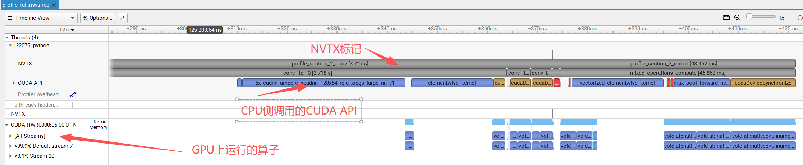
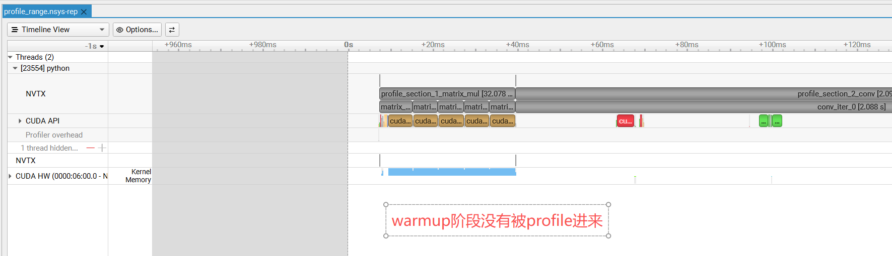

# NVIDIA Nsight Systems (nsys) Profile 使用教程

NVIDIA Nsight Systems 是一款系统级性能分析工具，用于可视化、分析和优化 CUDA 应用程序的性能。

## 安装

Nsight Systems 通常随 CUDA Toolkit 一起安装，也可以单独下载：
- [Nsight Systems 下载页面](https://developer.nvidia.com/nsight-systems)
- 注意：服务器上profile使用的nsys和在桌面上查看的客户端版本必须一致，否则文件打不开
## 案例一：完整程序分析

### 文件

| 文件 | 说明 |
|------|------|
| `nsys_full_profile.py` | PyTorch 示例代码，包含 NVTX 标记 |
| `run_full_profile.sh` | 启动脚本 |

### 运行

```bash
bash run_full_profile.sh
```

或手动执行：

```bash
nsys profile --stats=true --trace=cuda,nvtx --force-overwrite=true --output=profile_full python nsys_full_profile.py
```

此方式会捕获程序开始到结束的所有 CUDA 活动。

使用Nsight System客户端打开`profile_full.nsys-rep`后截图如下：


---

## 案例二：精确控制分析范围（推荐）

### 文件

| 文件 | 说明 |
|------|------|
| `nsys_range_profile.py` | PyTorch 示例代码，使用 profiler.start()/stop() |
| `run_range_profile.sh` | 启动脚本 |

### 运行

```bash
bash run_range_profile.sh
```

或手动执行：

```bash
nsys profile --stats=true --trace=cuda,nvtx --capture-range=cudaProfilerApi --force-overwrite=true --output=profile_range python nsys_range_profile.py
```

### 核心代码

```python
# 初始化和预热（不捕获）
warmup()

# 开始捕获
torch.cuda.profiler.start()
# 需要分析的代码
target_code()
# 结束捕获
torch.cuda.profiler.stop()
```

### 优点

- 跳过初始化和预热阶段，减少无关数据
- 精确定位性能瓶颈区域
- 减小输出文件大小

使用Nsight System客户端打开`profile_range.nsys-rep`后截图如下：


---

## NVTX API 说明

| API | 用途 |
|-----|------|
| `nvtx.mark("name")` | 在时间线上插入一个标记点 |
| `nvtx.range_push("name")` | 开始一个命名范围 |
| `nvtx.range_pop()` | 结束当前范围 |
| `torch.cuda.profiler.start()` | 开始捕获（配合 --capture-range） |
| `torch.cuda.profiler.stop()` | 结束捕获 |

---

## 常用 nsys profile 参数

| 参数 | 说明 |
|------|------|
| `--stats=true` | 生成统计摘要 |
| `--trace=cuda,nvtx` | 追踪 CUDA 和 NVTX 标记 |
| `--output=<name>` | 输出文件名前缀 |
| `--force-overwrite=true` | 覆盖已存在的输出文件 |
| `--gpu-metrics-device=all` | 收集所有 GPU 指标 |
| `--capture-range=cudaProfilerApi` | 使用 profiler API 控制分析范围 |

---

## 查看分析结果

生成 `.nsys-rep` 文件后，使用 Nsight Systems GUI 打开：

```bash
nsys-ui profile_full.nsys-rep
# 或
nsys-ui profile_range.nsys-rep
```

在 GUI 中可以看到：
- CUDA API 调用时间线
- GPU 内核执行情况
- NVTX 标记和范围（在 NVTX 行显示）

---

## 常见问题

### 1. nsys 命令找不到

确保 CUDA Toolkit 的 bin 目录在 PATH 环境变量中：

```bash
export PATH=/usr/local/cuda/bin:$PATH
```

### 2. 权限问题

某些分析功能需要 root 权限：

```bash
sudo nsys profile ...
```

### 3. 输出文件过大

使用精确控制分析范围（案例二），跳过预热阶段。

---

## 参考资料

- [Nsight Systems 官方文档](https://docs.nvidia.com/nsight-systems/)
- [NVTX API 文档](https://nvidia.github.io/NVTX/doxygen/index.html)
- [PyTorch Profiler 教程](https://pytorch.org/tutorials/recipes/recipes/profiler_recipe.html)