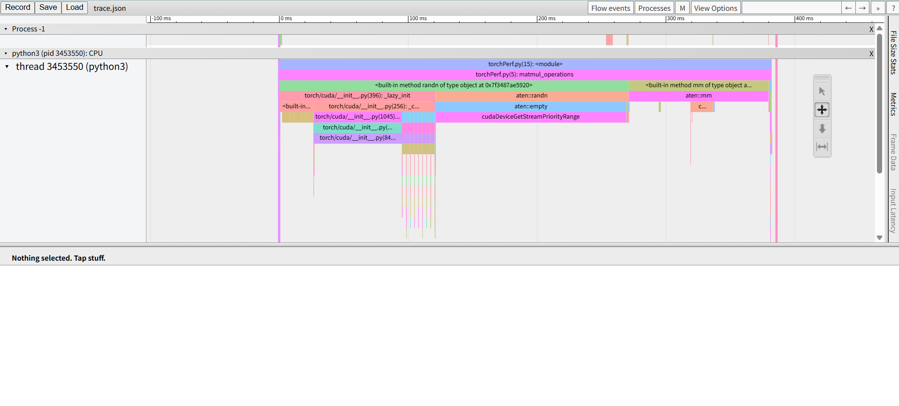

# Pytorch内置的性能分析工具

[官方链接](https://docs.pytorch.org/tutorials/recipes/recipes/profiler_recipe.html)

## 案例一
当前目录下会保存一个`trace.json`，在Google Chrome浏览器的`chrome://tracing`上载入`trace.json`，显示如下：

当然用户也可以尝试运行脚本：`python torchPer.py`，自行生成新的`trace.json`。

## 常见问题
- 如果遇到chrome浏览器报错提示“内部调试页面目前已停用。”，进入`chrome://chrome-urls`，去点击"enable internal debugging pages"按钮即可。

